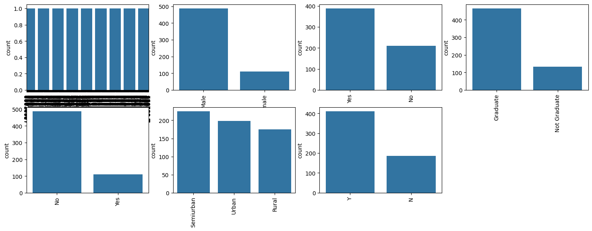
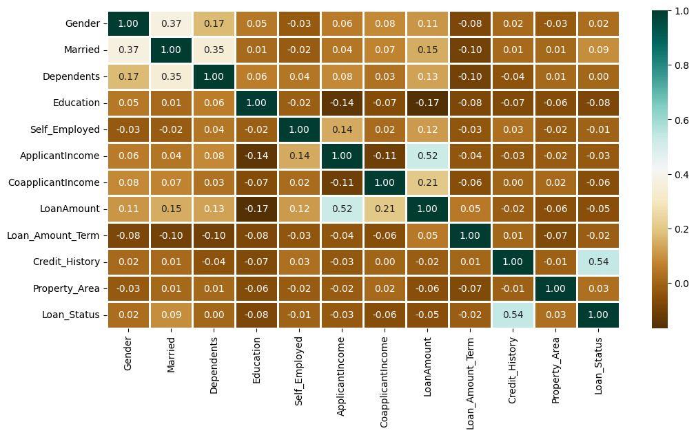
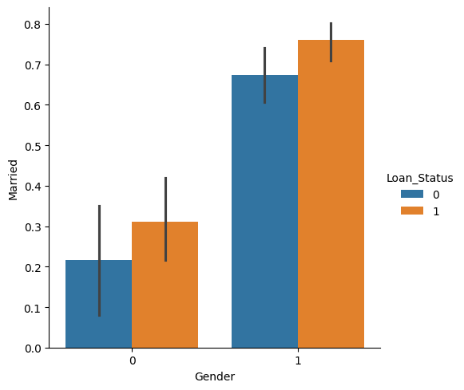

# loan-approval-prediction
Loan approval prediction using SVM


This project predicts whether a loan application will be approved or rejected based on applicant details such as income, credit history, loan amount, and other financial features. 
We use a Support Vector Machine (SVM) classifier for accurate predictions. The model is trained on a cleaned and preprocessed dataset, and evaluation metrics like accuracy are provided.


## 📂 Project Structure
- **data/** → dataset (LoanApprovalPrediction.csv)  
- **src/** → source code  
  - preprocess.py → data cleaning & encoding  
  - visualize.py → data visualization  
  - train.py → train-test split & SVM training  
  - evaluate.py → accuracy evaluation  
- **reports/** → final project report  
- **main.py** → runs the full pipeline  
- **requirements.txt** → required libraries  

## ⚙️ Requirements
- pandas  
- numpy  
- matplotlib  
- seaborn  
- scikit-learn  

Install using:
```bash
pip install -r requirements.txt

## 📊 Exploratory Data Analysis (EDA)

### 1. Data Distribution


### 2. Correlation Heatmap


### 3. Gender vs Loan Status



